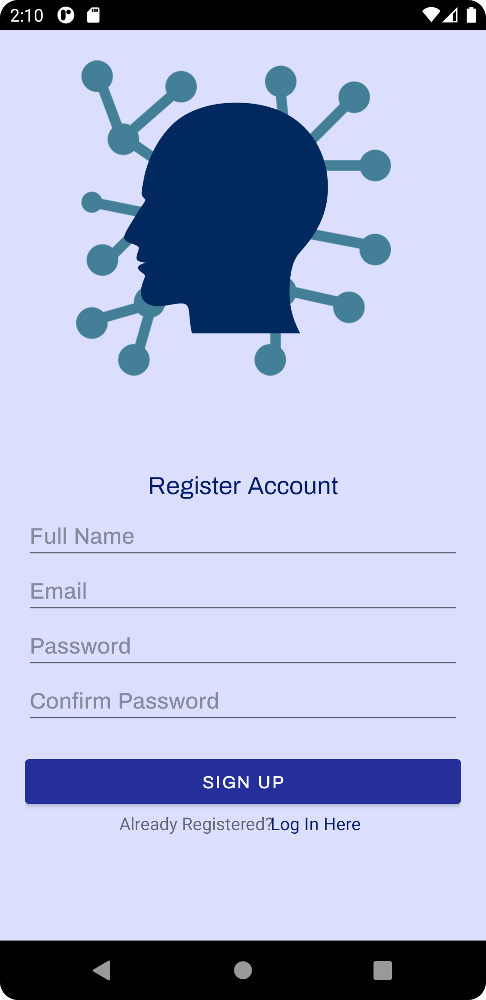
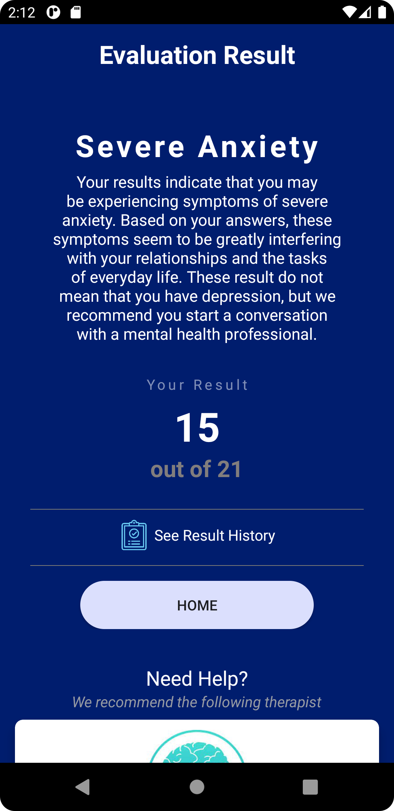

# Mental Status
A mental health evaluation application to track or identify the severity of your mental health problems and to raise awareness.
 
</img>
 
<i>Disclaimer: This application is information purposes only and is not intended to replace a consultation with your doctor or a mental health professional.</i>

# Adviser
- Jefferson A. Costales

# Developers
- Jester De La Cruz
- Philip Josua Sarmiento
- Angela Bayanay
- Ismael Centeno

# Institute 

Eulogio "Amang" Rodriguez Insitute of Science and Technology

Nagtahan, Sampaloc, Manila, Philippines

College of Arts and Sciences

# Course and Subject
BS Info Tech 3B

Mobile Application Development 1

# Application Overview
Application UI Screenshots.
<h3>Login Page</h3>
</img>  
<h3>Register Page</h3>
</img>  
<h2>Application Main Page</h2>
<h3>Home Page</h3>
</img>  
<h3>Landing Page</h3>
</img>  
<h3>Agreement Page</h3>
</img>  
<h3>Questions</h3>
</img>  
<h3>Result Page</h3>
</img>  

